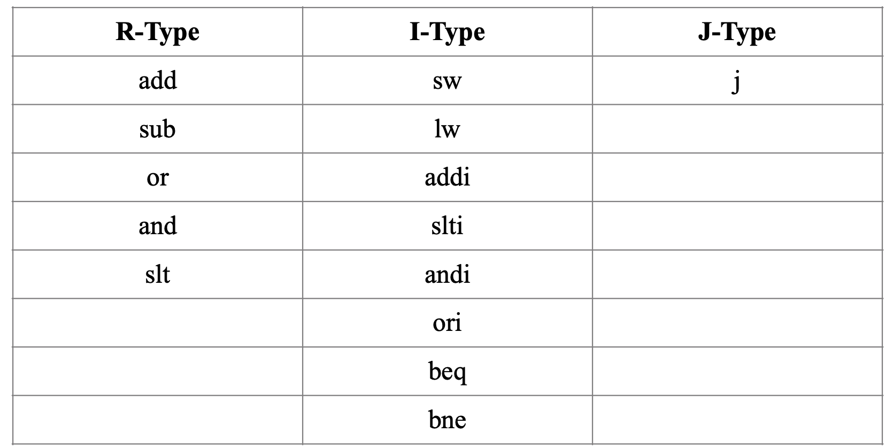
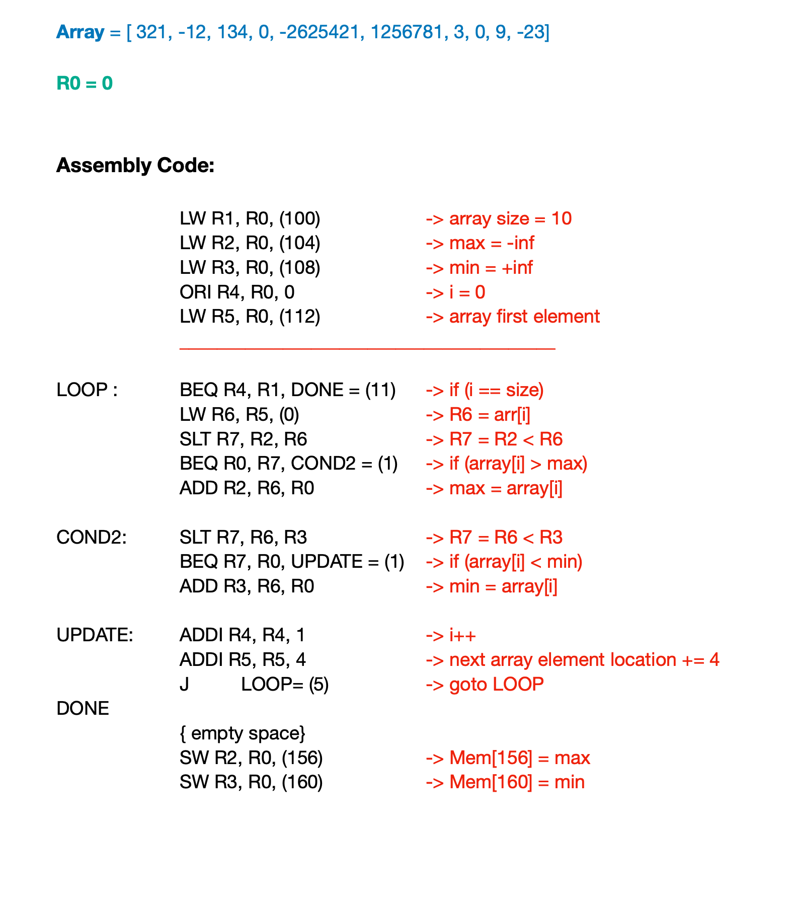

# FUM-MIPS
## Overview
FUM-MIPS is a 5-stage CPU, that supports a subset of the MIPS Instruction Set. It is a 32-bit CPU with 32 general-purpose registers.
The figure below shows an overview of the architecture.


Supporting instructions are brought in the table below.




In this version, all data and control hazards are handled with stalls and there are no forwarding paths.
My strategy for dealing with data hazards is to use a scoreboard for recognizing the pending registers.

### Code Structure
Each of the 5 stages is implemented as a goroutine and stages pass messages using buffered channels. This is the most accurate simulation according to how CPU's pipeline works, as stages work asynchronously.

## Application
The simulator gets a file to load the initial memory state and starts executing from the first line. To add an application, put your binary code in the "memory-initial-state" folder.\
For validating the simulator I write an app "array-max-min.txt" that iterates through an array of size 10 and writes maximum and minimum elements in memory words. Assembly code is as below:



And its equivalent binary code is:

```
10001100000000010000000001100100
10001100000000100000000001101000
10001100000000110000000001101100
00110100000001000000000000000000
10001100000001010000000001110000
00010000100000010000000000001011
10001100101001100000000000000000
00000000010001100011100000101010
00010000000001110000000000000001
00000000000001100001000000100000
00000000110000110011100000101010
00010000000001110000000000000001
00000000000001100001100000100000
00100000100001000000000000000001
00100000101001010000000000000100
00001000000000000000000000000101

10101100000000100000000010011100
10101100000000110000000010100000


00000000000000000000000000001010
10000000000000000000000000000000
01111111111111111111111111111111
00000000000000000000000001110100
00000000000000000000000101000001
11111111111111111111111111110100
00000000000000000000000010000110
00000000000000000000000000000000
11111111110101111111000001110011
00000000000100110010110101001101
00000000000000000000000000000011
00000000000000000000000000000000
00000000000000000000000000001001
11111111111111111111111111101001
```

To see the result of excuting this code, go to `results` folder.

### Run
Go to the project's directory and enter `go build`, then type `./mips-simulator -file=<filename.txt>`. "filename" is composed of binary code of CPU instructions and data. Each of the 32-bit memory words must be on a new line. See attached example files.
