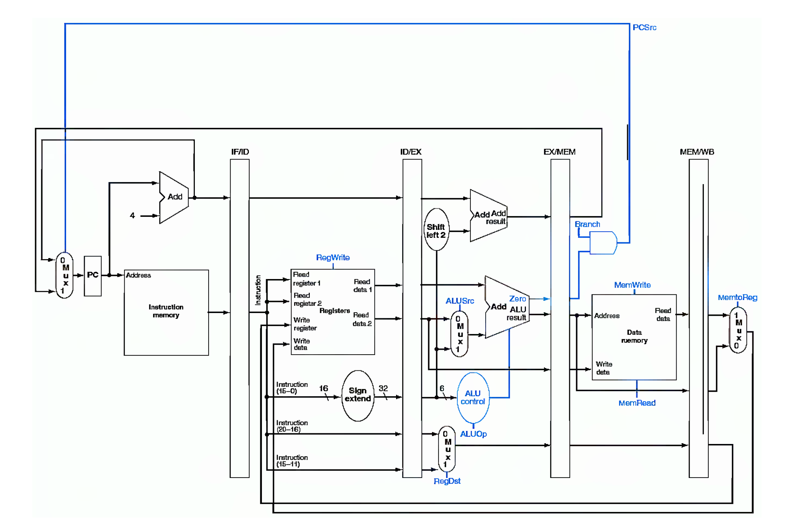

# FUM-MIPS
## Overview
FUM-MIPS is a 5-stage CPU, that supports a subset of MIPS Instruction Set. It is a 32-bit CPU with 32 general purpose registers.
Figure below shows an overview of the architecture.

Supporting instructions are brought in the table below.

In this version, all data and control hazards are handled with stalls and there are no forwarding paths.
My strategy for dealing with data hazards is to use a scoreboard for recognizing the pending registers.

### Code Structure
Each of 5 stages is implemented as a goroutine and stages pass messages using buffered channels. This is the most accurate simulation according to how CPU's pipeline works, as stages work asychronously.

## Application
The simulator gets a file to load the initial memory state and starts from the first line.
For validating the simulator I write an app "array-max-min.txt" that iterates through an array of size 10 and writes maximum and minimum elements in memory words.

### Run
Go to project's directory and enter `go build`, then type `./mips-simulator -file=<filename.txt>`. "filename" is composed of binary code of CPU intructions and data. Each of 32-bit memory words, must be on a new line. See attached example files.
